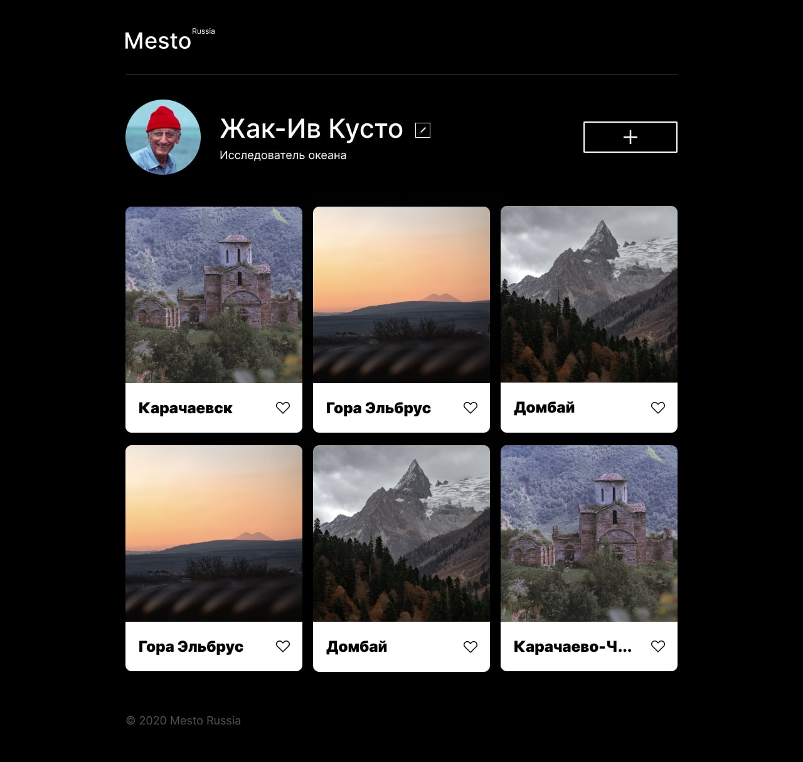

# Место
Небольшой сайт для добавления красивых фотографий

## Технологии
- **HTML** - добрый надежный язык гипертекстовой разметки 📋
- **CSS** - каскадные таблицы стилей для описания незабываемого дизайна веб-сайта ✨
- **JavaScript** - язык программирования для описания логики сайта 😱

## Особенности разработки
- **Grid** для резиновой верстки
- **Медиазапросы** для адаптивной верстки
- **Методология БЭМ** для грамотной разработки интерфейса
- **ООП** для чистого кода

## Ссылка на проект
[Место](https://PeachMood.github.io/mesto/index.html)
